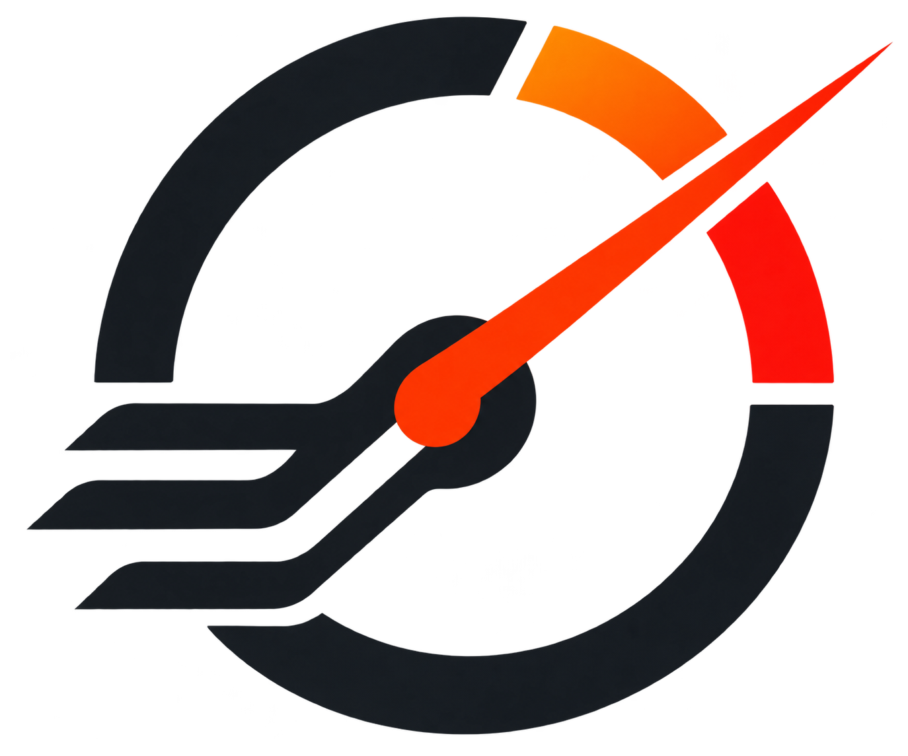
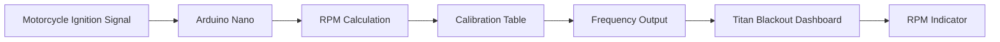

  <picture>
    <source
      media="(prefers-color-scheme: dark)"
      srcset="assets/dark-logo.png"
    >
    <source
      media="(prefers-color-scheme: light)"
      srcset="assets/light-logo.png"
    >
    
  </picture>

<h1 align="center">TitanPulse</h1>
<h3 align="center">Arduino-based tachometer signal system for Honda Fan 125 (2018) using the Titan Blackout dashboard.</h3>

 

<strong>Navigation</strong>

- [Objective](#objective)
- [Hardware](#hardware)
- [Arduino Pinout](#arduino-pinout)
- Signal Interface
  - [Motorcycle Signal Input](#motorcycle-signal-input)
  - [Dashboard Output](#dashboard-output)
- RPM Calculation
  - [How RPM Is Calculated](#how-rpm-is-calculated)
  - [Why Is There a Calibration Table?](#why-is-there-a-calibration-table)
- Calibration
  - [Calibration Table](#calibration-table)
  - [How to Calibrate](#how-to-calibrate)
  - [Table Structure](#table-structure)
  - [Changing the Calibration](#changing-the-calibration)
  - [Auditability](#auditability)
- Testing & Diagnostics
  - [Serial Monitor](#serial-monitor)
  - [Recommended Calibration Procedure](#recommended-calibration-procedure)
  - [Example](#example)
- Installation
  - [Compilation](#compilation)
- [Safety](#safety)
- [Known Limitations](#known-limitations)
- [Project Status](#project-status)
- [License](#license)

 

The project works as a signal converter:

## Objective

The 2018 Honda Fan 125 used in this project does not have a factory tachometer.

The objective is to use the signal from the ignition system to calculate engine speed and generate a signal compatible with the RPM input of an aftermarket 2023 Titan Blackout dashboard.

The dashboard did not show a simple linear relationship between input frequency and indicated RPM. Therefore, the project uses an experimental calibration table.

The Arduino does not attempt to mathematically reproduce the dashboard's internal operation.

Instead, it answers:

"When the engine is within this RPM range, what frequency makes this dashboard display that range correctly?"

This approach treats the dashboard as a black box that can be calibrated empirically.

## Hardware

### Motorcycle

- Honda Fan 125 2018

### Dashboard

- Aftermarket Titan 2023 Blackout

### Microcontroller

- Arduino Nano
- ATmega328P

### Components used

- Arduino Nano
- 10 kΩ resistor
- Copper wires
- Multimeter

The final installation should use soldered and properly insulated connections.

## Arduino Pinout

| Arduino Nano | Function |
|---|---|
| D2 | Motorcycle signal input |
| D9 | Frequency output to dashboard |
| GND | Common ground |

D2 uses an external interrupt to detect signal transitions.

D9 uses the ATmega328P Timer1 to generate the output frequency.

## Motorcycle Signal Input

The signal used in this project is the blue/yellow wire associated with the motorcycle's ignition pulse.

The signal is connected to D2 through a 10 kΩ resistor.

Simplified diagram:

    Blue/yellow signal
           |
          10 kΩ
           |
           +-------- D2 Arduino Nano

    Motorcycle GND
           |
           +-------- GND Arduino Nano

## Dashboard Output

D9 is connected to the dashboard's RPM input.

    Arduino D9
        |
        +-------- Dashboard RPM input

The Arduino GND and dashboard GND must share a common reference.

## How RPM Is Calculated

During testing, it was observed that the Arduino detects approximately 9.2 pulse events per engine revolution.

The code uses:

    PULSOS_POR_VOLTA = 9.2

At each measurement interval, the Arduino calculates the number of pulses per second and converts it to RPM:

    RPM = (pulsos_por_segundo × 60) / pulsos_por_volta

The reading is subsequently filtered to reduce fluctuations.

## Why Is There a Calibration Table?

The dashboard's behavior is not linear.

During testing, some frequencies produced approximately:

| Frequency | RPM indicated by dashboard |
|---:|---:|
| 8.0 Hz | ~2800 RPM |
| 8.2 Hz | ~4000 RPM |
| 8.4 Hz | ~6800 RPM |
| 8.6 Hz | ~11000+ RPM |
| 8.8 Hz | ~1800 RPM |
| 9.0 Hz | ~2300 RPM |
| 9.1 Hz | ~2500 RPM |
| 9.2 Hz | ~2800 RPM |
| 9.3 Hz | ~3000 RPM |
| 9.4 Hz | ~3500 RPM |
| 9.5 Hz | ~4200 RPM |
| 9.6 Hz | ~5000 RPM |
| 9.7 Hz | ~6000 RPM |
| 9.8 Hz | ~7800 RPM |
| 9.9 Hz | ~10500 RPM |
| 10.0 Hz | ~11000+ RPM |
| 25 Hz | ~4000 RPM |

These results demonstrate that it is not safe to assume a simple formula such as:

    frequency = RPM / constant

Therefore, the project uses a calibration table.

## Calibration Table

The table contains 44 positions.

Each position represents a 250 RPM range:

    [00] 250–499 RPM
    [01] 500–749 RPM
    [02] 750–999 RPM
    ...
    [43] 11000+ RPM

In the code:

    const float frequencias[44] = {
        ...
    };

Each position contains the frequency that should be sent to the dashboard for that RPM range.

## How to Calibrate

Calibration is performed with the engine turned off.

The Arduino can be used to send a fixed frequency to the dashboard.

For each frequency tested, observe the RPM indicated by the dashboard.

For example:

    8.20 Hz → dashboard indicates approximately 4000 RPM

If the goal is for the range:

    4000–4249 RPM

to be displayed as 4000 RPM by the dashboard, the corresponding table position should contain:

    8.20

Then, when the Arduino detects an RPM between 4000 and 4249, it will send 8.20 Hz.

The process is repeated for each range.

## Table Structure

The table follows this logic:

    Detected RPM
          ↓
    (RPM - 250) / 250
          ↓
       table index
          ↓
    corresponding frequency
          ↓
       dashboard

For example:

    4000 RPM
        ↓
     index 15
        ↓
    frequencias[15]
        ↓
    frequency configured for 4000–4249 RPM

## Changing the Calibration

The only part that normally needs to be changed during calibration is:

    const float frequencias[44]

The values can be completely non-linear.

For example:

    const float frequencias[44] = {
        8.20,
        8.20,
        9.01,
        8.74,
        9.03,
        8.91,
        9.14,
        ...
    };

There is no requirement for the values to increase uniformly.

The purpose of the table is to empirically reproduce the dashboard's response.

## Auditability

The project was designed so that the calibration can be audited directly in the code.

Each table entry includes a comment indicating its RPM range:

    8.200,   // [15] 4000 - 4249

This makes it possible to visually verify:

1. Which RPM range is being considered.
2. Which table index represents that range.
3. Which frequency will be sent to the dashboard.
4. Change any individual frequency without modifying the program logic.

## Serial Monitor

The Arduino sends information through the Serial Monitor at 115200 baud.

Example:

    RPM REAL: 4032 | QUADRADO: 15 | Hz ENVIADO: 8.200

This makes it possible to simultaneously verify:

- RPM calculated by the Arduino;
- index of the selected range;
- frequency sent to the dashboard.

## Recommended Calibration Procedure

For each range:

1. Determine the frequency that makes the dashboard display the desired RPM.
2. Allow the dashboard reading to stabilize.
3. Repeat the test to confirm that the reading is not just a momentary spike.
4. Record the frequency found.
5. Enter the value in the corresponding table position.
6. Test again with the engine running.
7. Adjust only that position if necessary.

It is recommended to record the results externally during testing before modifying the final calibration table.

## Example

Suppose testing produces:

    8.17 Hz → 3000 RPM
    8.21 Hz → 3250 RPM
    8.26 Hz → 3500 RPM
    8.34 Hz → 3750 RPM
    8.20 Hz → 4000 RPM

The table may contain:

    8.17,   // 3000
    8.21,   // 3250
    8.26,   // 3500
    8.34,   // 3750
    8.20,   // 4000

The order does not need to be ascending.

If 4000 RPM requires a lower frequency than 3750 RPM, that is acceptable. The dashboard is treated as a black box, and the table reproduces its observed behavior.

## Compilation

The project was developed for an Arduino Nano based on the ATmega328P.

In the Arduino IDE:

    Board:
    Arduino Nano

    Processor:
    ATmega328P

If a Nano with a different bootloader is used, select the corresponding option in the Arduino IDE.

## Installation

1. Connect the motorcycle signal to D2 through the 10 kΩ resistor.
2. Connect the motorcycle GND to the Arduino GND.
3. Connect D9 to the dashboard RPM input.
4. Upload the firmware.
5. Open the Serial Monitor at 115200 baud.
6. Verify that the Arduino is detecting RPM.
7. Verify the frequency being sent.
8. Calibrate the table.
9. After calibration, test with the engine running.

## Safety

This project works directly with electrical signals from a motorcycle.

The circuit presented here is experimental and should not be considered a professional automotive interface.

The input signal must be properly conditioned before permanent installation if voltages or transients outside the ATmega328P specifications are observed.

Never connect a signal directly to the Arduino if it may exceed the microcontroller's electrical limits.

All connections must be insulated and mechanically protected against vibration, moisture, and short circuits.

## Known Limitations

The project depends on the specific behavior of the Titan 2023 Blackout dashboard used during testing.

Another dashboard may use a different RPM input and require different calibration.

The frequency table is also specific to the combination of:

    Honda Fan 125 2018
    +
    Titan 2023 Blackout
    +
    Arduino Nano

Therefore, the table values should not be considered a universal specification.

## Project Status

The firmware is functional as a prototype, but not ready for practical use.

The architecture for signal reading, RPM calculation, range selection, and signal generation has been implemented.

The frequency table is deliberately editable and must be calibrated experimentally to achieve the best possible correspondence between the engine's actual RPM and the dashboard's displayed RPM.

## License

This project is licensed under the MIT License.

You are free to use, copy, modify, merge, publish, distribute, sublicense, and/or sell copies of the software, subject to the conditions of the license.

See the [LICENSE](LICENSE) file for the complete license text.
